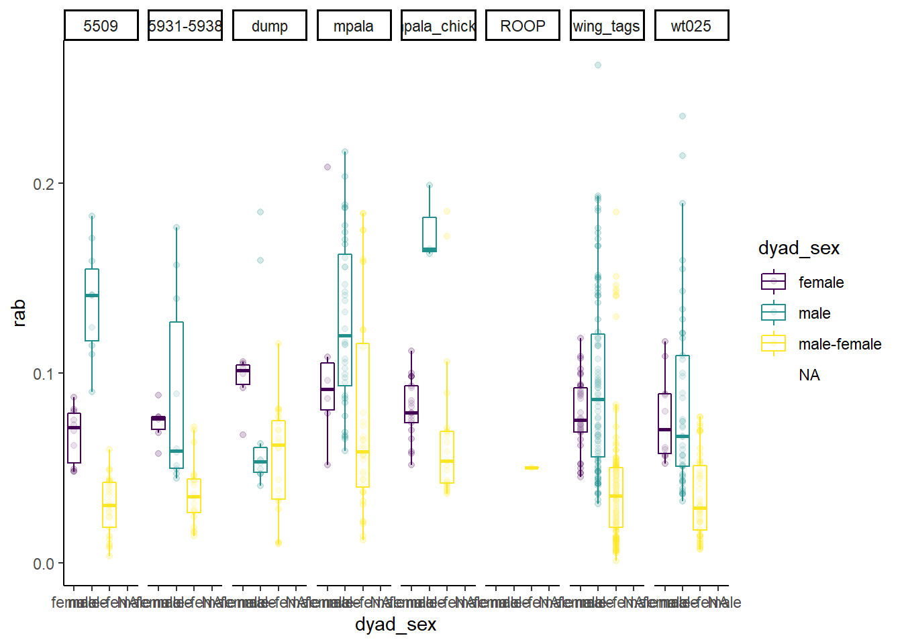

# Data


Data compiled and used in this project

## Setup


```r
library(tidyverse)
#> -- Attaching packages ---------------------------------------------------------------------- tidyverse 1.3.0 --
#> v ggplot2 3.3.2     v purrr   0.3.4
#> v tibble  3.0.3     v dplyr   1.0.2
#> v tidyr   1.1.2     v stringr 1.4.0
#> v readr   1.3.1     v forcats 0.5.0
#> -- Conflicts ------------------------------------------------------------------------- tidyverse_conflicts() --
#> x dplyr::filter() masks stats::filter()
#> x dplyr::lag()    masks stats::lag()
library(ggplot2)
library(ggthemes)
library(ggforce)
library(ggridges)
library(ggsci)
library(wesanderson)
library(ggallin)
```


## Data collection

Group information is stored in *sequenced_samples_groups.csv*.


```r
sampleID_group <- read.csv("vignettes/data/sequenced_samples_groups.csv", header = TRUE, sep = ";", as.is = TRUE)


str(sampleID_group)
#> 'data.frame':	95 obs. of  4 variables:
#>  $ Group_ID       : chr  "wing_tags" "wing_tags" "wing_tags" "wing_tags" ...
#>  $ Sample.ind.code: chr  "A1295" "A1296" "A1297" "A1298" ...
#>  $ Real.ind.code  : chr  "W1295" "W1296" "W1297" "W1298" ...
#>  $ Colour_.bands  : chr  "WT002" "WT003" "WT004" "WT021" ...

#rename Real.ind.code to ID
sampleID_group <- rename(sampleID_group, "ID" = "Sample.ind.code")

#only keep group and ID
sampleID_group <- select(sampleID_group, Group_ID, ID)
str(sampleID_group)
#> 'data.frame':	95 obs. of  2 variables:
#>  $ Group_ID: chr  "wing_tags" "wing_tags" "wing_tags" "wing_tags" ...
#>  $ ID      : chr  "A1295" "A1296" "A1297" "A1298" ...
```

There are three samples that are not listed correctly and would lead to NA's in downstream analysis, so we manually adjust them here


```r
#correct sample B1299 is missing
sample_info_add <- data.frame (Group_ID = c("wing_tags", "wing_tags", "5509"),
                               ID = c("B1299", "W1304", "W1345"))
sample_info_add
#>    Group_ID    ID
#> 1 wing_tags B1299
#> 2 wing_tags W1304
#> 3      5509 W1345

sampleID_group <- rbind(sampleID_group, sample_info_add)
```


Sex information is stored in *samples_sex.csv*. Sex was determined in the field and confirmed at least once with a molecular sexing method in the lab. For cases with mismatch between field and molecular sex we set the sex to undetermined. 


```r
sampleID_sex <- read.csv("vignettes/data/samples_sex.csv", header = TRUE, sep = ";", as.is = TRUE)
str(sampleID_sex)
#> 'data.frame':	133 obs. of  2 variables:
#>  $ ID : chr  "A1295" "A1296" "A1297" "A1298" ...
#>  $ sex: chr  "m" "f" "m" "m" ...
```

merge group and sex information


```r

sample_info <- full_join(sampleID_group, sampleID_sex, by = "ID")
str(sample_info)
#> 'data.frame':	133 obs. of  3 variables:
#>  $ Group_ID: chr  "wing_tags" "wing_tags" "wing_tags" "wing_tags" ...
#>  $ ID      : chr  "A1295" "A1296" "A1297" "A1298" ...
#>  $ sex     : chr  "m" "f" "m" "m" ...
```


## Data processing

### Sequencing data

First, we load an overview of the analysed sequencing libraries. They are stored in the folder `pipeline` as *file_list.tsv*. 


```r
seqlib_overview <- read.delim("vignettes/data/pipeline/file_list.tsv", header = TRUE,  as.is = TRUE)
str(seqlib_overview)
#> 'data.frame':	238 obs. of  6 variables:
#>  $ file_name: chr  "mpg_L16936-1_W1350_S1_R1_001.fastq.gz" "mpg_L16936-1_W1350_S1_R2_001.fastq.gz" "mpg_L16926-1_W1398_S2_R1_001.fastq.gz" "mpg_L16926-1_W1398_S2_R2_001.fastq.gz" ...
#>  $ RGID     : int  1 1 1 1 1 1 1 1 1 1 ...
#>  $ RGLB     : chr  "lib1" "lib1" "lib1" "lib1" ...
#>  $ RGPL     : chr  "ILLUMINA" "ILLUMINA" "ILLUMINA" "ILLUMINA" ...
#>  $ RGPU     : chr  "unit1" "unit1" "unit1" "unit1" ...
#>  $ RGSM     : chr  "RGID1_S1" "RGID1_S1" "RGID1_S2" "RGID1_S2" ...
```

The information about the sampled individual, which we will later need to assign the relatedness estimation to specific individuals, is available in the *file_name* column. We will extract this information and put it in an extra *ID* column.


```r
#first need to create a new column that includes the sample ID
seqlib_overview$ID <- gsub("([[:alnum:]]{3}_[[:alnum:]]{6}-[[:digit:]])_([[:alnum:]]{5,7})_([[:alnum:]]{2,3}_[[:alnum:]]{2}_[[:graph:]]{12})", "\\2", seqlib_overview$file_name)

str(seqlib_overview)
#> 'data.frame':	238 obs. of  7 variables:
#>  $ file_name: chr  "mpg_L16936-1_W1350_S1_R1_001.fastq.gz" "mpg_L16936-1_W1350_S1_R2_001.fastq.gz" "mpg_L16926-1_W1398_S2_R1_001.fastq.gz" "mpg_L16926-1_W1398_S2_R2_001.fastq.gz" ...
#>  $ RGID     : int  1 1 1 1 1 1 1 1 1 1 ...
#>  $ RGLB     : chr  "lib1" "lib1" "lib1" "lib1" ...
#>  $ RGPL     : chr  "ILLUMINA" "ILLUMINA" "ILLUMINA" "ILLUMINA" ...
#>  $ RGPU     : chr  "unit1" "unit1" "unit1" "unit1" ...
#>  $ RGSM     : chr  "RGID1_S1" "RGID1_S1" "RGID1_S2" "RGID1_S2" ...
#>  $ ID       : chr  "W1350" "W1350" "W1398" "W1398" ...
```


Next, we evaluate the quality of the data and the different sequencing approaches.
An overview of the data as output from the Nextflow pipeline as of 29th July 2021 is stored in *preprocessing_overview.tsv*


```r
data_overview <- read.delim("vignettes/data/pipeline/preprocessing_overview.tsv", as.is = TRUE)
str(data_overview)
#> 'data.frame':	119 obs. of  31 variables:
#>  $ RGSM                                     : chr  "RGID1_S1" "RGID1_S2" "RGID1_S3" "RGID1_S4" ...
#>  $ RGID                                     : int  1 1 1 1 1 1 1 1 1 1 ...
#>  $ RGLB                                     : chr  "lib1" "lib1" "lib1" "lib1" ...
#>  $ RGPL                                     : chr  "ILLUMINA" "ILLUMINA" "ILLUMINA" "ILLUMINA" ...
#>  $ RGPU                                     : chr  "unit1" "unit1" "unit1" "unit1" ...
#>  $ filename_one                             : chr  "mpg_L16936-1_W1350_S1_R1_001.fastq.gz" "mpg_L16926-1_W1398_S2_R1_001.fastq.gz" "mpg_L16927-1_W1429_S3_R1_001.fastq.gz" "mpg_L16928-1_W1502_S4_R1_001.fastq.gz" ...
#>  $ filename_two                             : chr  "mpg_L16936-1_W1350_S1_R2_001.fastq.gz" "mpg_L16926-1_W1398_S2_R2_001.fastq.gz" "mpg_L16927-1_W1429_S3_R2_001.fastq.gz" "mpg_L16928-1_W1502_S4_R2_001.fastq.gz" ...
#>  $ reads_pre_trim_one                       : int  3844063 3360132 3034920 6695288 6040662 2842383 3879834 6087445 5686616 4107154 ...
#>  $ reads_pre_trim_two                       : int  3844063 3360132 3034920 6695288 6040662 2842383 3879834 6087445 5686616 4107154 ...
#>  $ reads_pre_trim_total                     : int  7688126 6720264 6069840 13390576 12081324 5684766 7759668 12174890 11373232 8214308 ...
#>  $ reads_post_trim_one                      : int  3334957 3057420 2775271 6144973 5496263 2618095 3544978 5592586 5206646 3740830 ...
#>  $ reads_post_trim_two                      : int  3317567 2622060 2444309 5472149 4763684 2298940 2933104 4916336 4551423 3252219 ...
#>  $ reads_post_trim_total                    : int  6652524 5679480 5219580 11617122 10259947 4917035 6478082 10508922 9758069 6993049 ...
#>  $ reads_trimmed_lost_one                   : int  509106 302712 259649 550315 544399 224288 334856 494859 479970 366324 ...
#>  $ reads_trimmed_lost_two                   : int  526496 738072 590611 1223139 1276978 543443 946730 1171109 1135193 854935 ...
#>  $ reads_trimmed_lost_total                 : int  1035602 1040784 850260 1773454 1821377 767731 1281586 1665968 1615163 1221259 ...
#>  $ reads_trimmed_lost_total_percent         : num  0.135 0.155 0.14 0.132 0.151 ...
#>  $ reads_mapped                             : int  6448222 5897151 5344556 11948516 10542799 5052562 6862719 10880329 10069374 7213292 ...
#>  $ reads_mapped_and_paired                  : int  6124942 4910684 4546908 10259622 8836944 4295176 5524338 9244878 8510126 6063336 ...
#>  $ reads_unmapped                           : int  158628 176787 170192 251546 386867 143020 186719 234815 276382 223486 ...
#>  $ reads_mapped_percent                     : num  0.975 0.97 0.968 0.979 0.963 ...
#>  $ average_coverage                         : num  1.6 1.63 1.58 2.16 2.07 ...
#>  $ average_coverarge_stdev                  : num  2.67 2.8 2.62 2.98 3.64 ...
#>  $ unpaired_reads_examined_for_deduplication: int  323280 986467 797648 1688894 1705855 757386 1338381 1635451 1559248 1149956 ...
#>  $ paired_reads_examined_for_deduplication  : int  3094003 2475793 2291351 5174753 4449902 2167892 2782428 4657453 4288831 3054109 ...
#>  $ unpaired_read_duplicated                 : int  66109 106320 78976 195164 185282 87774 136509 172933 169988 118239 ...
#>  $ paired_read_duplicates                   : int  221442 119369 103005 260460 197926 115543 120104 206962 194659 133521 ...
#>  $ percent_duplication                      : num  0.0782 0.0581 0.053 0.0595 0.0548 ...
#>  $ sequenced_library_complexity             : int  6090385 5720981 5222642 11474365 10330774 4870312 6664743 10519461 9774928 7042018 ...
#>  $ estimated_library_complexity             : int  23660823 29649178 29602264 59328308 57146455 23492191 37280729 60581428 54839066 40354282 ...
#>  $ percent_library_sequenced                : num  0.257 0.193 0.176 0.193 0.181 ...
```

One sequencing library was resequenced in an additionl run but wrongly assigned to RGID 1, so we correct this


```r

data_overview$RGID[data_overview$filename_one == "mpg_L16936-1_W1350_S1_R1_001.fastq.gz"] <- "2"
```


```r
#create new column that specifies if sequencing results are from original run or from resequencing
data_overview <- data_overview %>%
  mutate(original_reseq = case_when(RGID == "1" ~ "original",
                                RGID == "2" ~ "reseq"))
```


```r
#first need to create a new column that includes the sample ID
data_overview$ID <- gsub("([[:alnum:]]{3}_[[:alnum:]]{6}-[[:digit:]])_([[:alnum:]]{5,7})_([[:alnum:]]{2,3}_[[:alnum:]]{2}_[[:graph:]]{12})", "\\2", data_overview$filename_one)

str(data_overview)
#> 'data.frame':	119 obs. of  33 variables:
#>  $ RGSM                                     : chr  "RGID1_S1" "RGID1_S2" "RGID1_S3" "RGID1_S4" ...
#>  $ RGID                                     : chr  "2" "1" "1" "1" ...
#>  $ RGLB                                     : chr  "lib1" "lib1" "lib1" "lib1" ...
#>  $ RGPL                                     : chr  "ILLUMINA" "ILLUMINA" "ILLUMINA" "ILLUMINA" ...
#>  $ RGPU                                     : chr  "unit1" "unit1" "unit1" "unit1" ...
#>  $ filename_one                             : chr  "mpg_L16936-1_W1350_S1_R1_001.fastq.gz" "mpg_L16926-1_W1398_S2_R1_001.fastq.gz" "mpg_L16927-1_W1429_S3_R1_001.fastq.gz" "mpg_L16928-1_W1502_S4_R1_001.fastq.gz" ...
#>  $ filename_two                             : chr  "mpg_L16936-1_W1350_S1_R2_001.fastq.gz" "mpg_L16926-1_W1398_S2_R2_001.fastq.gz" "mpg_L16927-1_W1429_S3_R2_001.fastq.gz" "mpg_L16928-1_W1502_S4_R2_001.fastq.gz" ...
#>  $ reads_pre_trim_one                       : int  3844063 3360132 3034920 6695288 6040662 2842383 3879834 6087445 5686616 4107154 ...
#>  $ reads_pre_trim_two                       : int  3844063 3360132 3034920 6695288 6040662 2842383 3879834 6087445 5686616 4107154 ...
#>  $ reads_pre_trim_total                     : int  7688126 6720264 6069840 13390576 12081324 5684766 7759668 12174890 11373232 8214308 ...
#>  $ reads_post_trim_one                      : int  3334957 3057420 2775271 6144973 5496263 2618095 3544978 5592586 5206646 3740830 ...
#>  $ reads_post_trim_two                      : int  3317567 2622060 2444309 5472149 4763684 2298940 2933104 4916336 4551423 3252219 ...
#>  $ reads_post_trim_total                    : int  6652524 5679480 5219580 11617122 10259947 4917035 6478082 10508922 9758069 6993049 ...
#>  $ reads_trimmed_lost_one                   : int  509106 302712 259649 550315 544399 224288 334856 494859 479970 366324 ...
#>  $ reads_trimmed_lost_two                   : int  526496 738072 590611 1223139 1276978 543443 946730 1171109 1135193 854935 ...
#>  $ reads_trimmed_lost_total                 : int  1035602 1040784 850260 1773454 1821377 767731 1281586 1665968 1615163 1221259 ...
#>  $ reads_trimmed_lost_total_percent         : num  0.135 0.155 0.14 0.132 0.151 ...
#>  $ reads_mapped                             : int  6448222 5897151 5344556 11948516 10542799 5052562 6862719 10880329 10069374 7213292 ...
#>  $ reads_mapped_and_paired                  : int  6124942 4910684 4546908 10259622 8836944 4295176 5524338 9244878 8510126 6063336 ...
#>  $ reads_unmapped                           : int  158628 176787 170192 251546 386867 143020 186719 234815 276382 223486 ...
#>  $ reads_mapped_percent                     : num  0.975 0.97 0.968 0.979 0.963 ...
#>  $ average_coverage                         : num  1.6 1.63 1.58 2.16 2.07 ...
#>  $ average_coverarge_stdev                  : num  2.67 2.8 2.62 2.98 3.64 ...
#>  $ unpaired_reads_examined_for_deduplication: int  323280 986467 797648 1688894 1705855 757386 1338381 1635451 1559248 1149956 ...
#>  $ paired_reads_examined_for_deduplication  : int  3094003 2475793 2291351 5174753 4449902 2167892 2782428 4657453 4288831 3054109 ...
#>  $ unpaired_read_duplicated                 : int  66109 106320 78976 195164 185282 87774 136509 172933 169988 118239 ...
#>  $ paired_read_duplicates                   : int  221442 119369 103005 260460 197926 115543 120104 206962 194659 133521 ...
#>  $ percent_duplication                      : num  0.0782 0.0581 0.053 0.0595 0.0548 ...
#>  $ sequenced_library_complexity             : int  6090385 5720981 5222642 11474365 10330774 4870312 6664743 10519461 9774928 7042018 ...
#>  $ estimated_library_complexity             : int  23660823 29649178 29602264 59328308 57146455 23492191 37280729 60581428 54839066 40354282 ...
#>  $ percent_library_sequenced                : num  0.257 0.193 0.176 0.193 0.181 ...
#>  $ original_reseq                           : chr  "reseq" "original" "original" "original" ...
#>  $ ID                                       : chr  "W1350" "W1398" "W1429" "W1502" ...
```

save data overview

```r
save(data_overview, file = "data_overview.RData")
```

Calculate total and mean number of raw reads
!!paired-end sequencing, so need to account for that

```r

total_raw_reads <- sum(data_overview$reads_pre_trim_total)
total_raw_reads
#> [1] 1393934732

mean_raw_reads <- mean(data_overview$reads_pre_trim_total)
mean_raw_reads
#> [1] 11713737

sd_raw_reads <- sd(data_overview$reads_pre_trim_total)
sd_raw_reads
#> [1] 5979400
```

Calculate total and mean number of quality filtered reads


```r

total_filtered_reads <- sum(data_overview$reads_post_trim_total)
total_filtered_reads
#> [1] 1218247416

percent_filtered_reads <- total_filtered_reads/total_raw_reads  
percent_filtered_reads
#> [1] 0.873963

mean_filtered_reads <- mean(data_overview$reads_post_trim_total)
mean_filtered_reads
#> [1] 10237373

percent_mean_filtered_reads <- mean_filtered_reads/mean_raw_reads
percent_mean_filtered_reads
#> [1] 0.873963

sd_filtered_reads <- sd(data_overview$reads_post_trim_total)
sd_filtered_reads
#> [1] 5426886


median_Trimmomatic_dropped <- median(data_overview$reads_trimmed_lost_total, na.rm = TRUE)
median_Trimmomatic_dropped
#> [1] 1310301

IQR_Trimmomatic_dropped <- IQR(data_overview$reads_trimmed_lost_total, na.rm = TRUE)
IQR_Trimmomatic_dropped
#> [1] 749127

range_Trimmomatic_dropped <- range(data_overview$reads_trimmed_lost_total, na.rm = TRUE)
range_Trimmomatic_dropped
#> [1]  323232 4158669
```

Calculate mapped reads

```r
median_mapped_reads <- median(data_overview$reads_mapped)
median_mapped_reads
#> [1] 9498515

IQR_mapped_reads <- IQR(data_overview$reads_mapped)
IQR_mapped_reads
#> [1] 6902176

range_mapped_reads <- range(data_overview$reads_mapped)
range_mapped_reads
#> [1]  1843218 32346499
```

Calculate duplicates

```r
median_duplicates <- median(data_overview$percent_duplication)
median_duplicates
#> [1] 0.056526

range_duplicates <- range(data_overview$percent_duplication)
range_duplicates
#> [1] 0.039762 0.100763
```


Calculate final coverage

```r
median_final_coverage <- median(data_overview$average_coverage)
median_final_coverage
#> [1] 1.91596

IQR_final_coverage <- IQR(data_overview$average_coverage)
IQR_final_coverage
#> [1] 0.601805

range_final_coverage <- range(data_overview$average_coverage)
range_final_coverage
#> [1] 1.33748 4.31431
```


For the sequencing success, we compare the reads that passed Quality control (FastCQ and Trimmotaic) depending on original run (RGID = 1) and resequencing (RGID = 2).

```r
theme_set(theme_bw()) #set theme to black and white

#compare reads (y-axis) between original vs. resequenced (x-axis, sorted to have original first) and color according to library prep (shotgun vs. capture)
ggplot(data_overview, aes(x = factor(RGID, level = c("1", "2")), y = reads_post_trim_total, color = original_reseq, shape = original_reseq)) + 
  
   scale_color_viridis_d(end = 0.5) +

  geom_point(size = 2, alpha = 0.6, aes(group = ID), position = position_dodge(0.5)) + #make points, transparent, and group samples
  
  geom_boxplot(alpha = 0.4, outlier.shape = NA) + #add boxplots but do not show them in legend
  
  #geom_violin(alpha = 0.5) + #or add violin plots
  
  
  geom_line(aes(group = ID), color = "grey", position = position_dodge(0.5), show.legend = FALSE) + #add line to connect samples present in both sequencing runs
  
  #stat_summary(fun = median, geom = "point", size = 5, alpha = 0.3, position = position_dodge(0.5)) +
  
  labs(x = "sequencing run", y = "reads after quality filtering") + #adjust axis labels
  
 
  theme(legend.title = element_blank()) + #remove legend title
  
  theme(panel.grid.major.x = element_blank())  #remove x-axis grid lines
```


Maybe more informative about the success of the approaches is to compare % reads that mapped.


```r
theme_set(theme_bw()) #set theme to black and white

#compare mapped reads (y-axis) between sequencing (x-axis, sorted to have original first) and color according to sequencing run
ggplot(data_overview, aes(x = factor(RGID, level = c("1", "2")), y = reads_mapped_and_paired, color = original_reseq, shape = original_reseq)) + 
  
  scale_color_viridis_d(end = 0.5) +

  geom_point(size = 2, alpha = 0.6, aes(group = ID), position = position_dodge(0.5)) + #make points, transparent, and group samples
  
  geom_boxplot(alpha = 0.4, outlier.shape = NA) + #add boxplots but do not show them in legend
  
  #geom_violin(alpha = 0.5) + #or add violin plots
  
  
  geom_line(aes(group = ID), color = "grey", position = position_dodge(0.5), show.legend = FALSE) + #add line to connect samples present in both sequencing approaches
  
  #stat_summary(fun = median, geom = "point", size = 5, alpha = 0.3, position = position_dodge(0.5)) +
  
  labs(x = "sequencing run", y = "mapped reads") + #adjust axis labels
  
 
  theme(legend.title = element_blank()) + #remove legend title
  
  theme(panel.grid.major.x = element_blank())  #remove x-axis grid lines
```


Finally, let's have a look at the coverage


```r

theme_set(theme_bw()) #set theme to black and white

#relate number of reads (y-axis) to final coverage (x-axis), color according to sequencing run (original vs. resequenced) and sample type, shape according to original run or resequencing
ggplot(data_overview, aes(x = average_coverage, y = reads_post_trim_total, color = original_reseq, shape = original_reseq)) +
  
  scale_color_viridis_d(end = 0.5) +
  
  geom_line(aes(group = ID), color = "lightgrey", show.legend = FALSE) + #connect same samples
  
  geom_point(alpha = 0.5, aes(size = reads_mapped_and_paired, group = ID)) + #add points with slight transparency
  
  geom_vline(xintercept = 1, linetype = "dashed") + #include vertical line to show coverage cutoff
  
    #scale_y_log10(breaks = scales::trans_breaks("log10", function(x) 10^x), labels = scales::trans_format("log10", scales::math_format(10^.x))) + #make y-axis logarithmic
  
  #scale_x_log10() + #make x-axis logarithmic
  
  #annotation_logticks() +
  
  labs(x = "coverage", y = "reads (after quality filtering)", 
       size = "% reads mapped", color ="", shape = "") 
```


C-Curve


```r
theme_set(theme_bw()) #set theme to black and white

#relate number of distinct reads (y-axis) to total reads (x-axis), color and shape according to original run or resequencing
ggplot(data_overview, aes(x = unpaired_reads_examined_for_deduplication, y = sequenced_library_complexity, color = original_reseq, shape = original_reseq)) +
  
  geom_line(aes(group = ID), color = "lightgrey", show.legend = FALSE) + #connect same samples
  
  geom_point(alpha = 0.5, aes(size = average_coverage, group = ID)) + #add points with slight transparency
  
  theme(panel.grid.minor.x = element_blank(), panel.grid.minor.y = element_blank()) + #remove x/y-axis grid lines
  
  labs(x = "total unpaired reads", y = "sequenced library complexity", 
       size = "coverage", color ="", shape = "") + #adjust axis and legend labels
  
   scale_color_viridis_d(end = 0.5)
```


comparison to total surviving reads from Trimmomatic to distinct mapped reads


```r
theme_set(theme_bw()) #set theme to black and white

#relate number of distinct reads (y-axis) to total surviving reads (x-axis), color  and sample type, shape according to original run or resequencing
ggplot(data_overview, aes(x =  reads_post_trim_total, y = sequenced_library_complexity, color = original_reseq, shape = original_reseq)) +
  
  scale_color_viridis_d(end = 0.5) +
  
  geom_point(alpha = 0.5, aes(size = average_coverage, group = ID)) + #add points with slight transparency
  
  theme(panel.grid.minor.x = element_blank(), panel.grid.minor.y = element_blank()) + #remove x/y-axis grid lines
  
  labs(x = "total surviving reads (Trimmomatic)", y = "sequenced library complexity", 
       size = "coverage", color ="", shape = "")  #adjust axis and legend labels
```


plot  coverage and st.dv.


```r
theme_set(theme_bw()) #set theme to black and white

#plot coverage (y-axis) including st.dev for every sample (x-axis), color according to original run or resequencing
ggplot(filter(data_overview, original_reseq == "original"), aes(x = reorder(ID, average_coverage), y = average_coverage, color = original_reseq, shape = original_reseq)) +
  
  scale_color_viridis_d(end = 0.5) +
  
  geom_point(aes(y=average_coverage), alpha = 0.8) +
  
  geom_point(data = filter(data_overview, original_reseq == "reseq"), aes(y=average_coverage), alpha = 0.8) +
  
  geom_errorbar(data = filter(data_overview, original_reseq == "reseq"), aes(ymin = average_coverage - average_coverarge_stdev, ymax = average_coverage + average_coverarge_stdev), alpha = 0.8) +
  
  geom_errorbar(aes(ymin = average_coverage - average_coverarge_stdev, ymax = average_coverage + average_coverarge_stdev), alpha = 0.8) +
  
  geom_hline(yintercept = 1, linetype = "dashed") + #include horizontal line to show coverage cutoff at 1X
  
  geom_hline(yintercept = median_final_coverage, linetype = "dotted") +
  
  coord_cartesian(ylim = c(0, 10)) + #adjust y axis
  
  scale_y_continuous(breaks = c(0, 2, 4, 6, 8, 10)) + 
  
  labs(x = "sample", y = "coverage (mean+-sd)", 
       color ="", shape = "") + #adjust axis and legend labels
  
  theme(axis.text.x = element_text(angle = 50, vjust = 1, hjust = 1, size = 8)) +
  
  scale_x_discrete(guide = guide_axis(n.dodge=2))  #avoid overlap of x-axis labels
```


### Relatedness data


#### ngsRelate
This is an assessment of the ngsRelate results produced by the Nextflow pipleine created by Ben Hume/SeqAna. The data is saved in the folder `pipeline` in `ngsrelate` as *relatedness.isec.0002.exMito.thinned.ngsrelate.w.sample.names.results*. We now use the results excluding replicated samples and the Z chromosome, which are stored in `pipeline/no_repeats_no_Z_relatedness_results/nextflow_output/ngsrelate`.


```r
ngsRelate_results <- read.delim("vignettes/data/pipeline/no_repeats_no_Z_relatedness_results/nextflow_output/ngsrelate/relatedness.isec.0002.exMito.thinned.ngsrelate.results", header = TRUE,  as.is = TRUE)
str(ngsRelate_results)
#> 'data.frame':	4560 obs. of  35 variables:
#>  $ a                     : int  0 0 0 0 0 0 0 0 0 0 ...
#>  $ b                     : int  1 2 3 4 5 6 7 8 9 10 ...
#>  $ ida                   : chr  "RGID1_S83" "RGID1_S83" "RGID1_S83" "RGID1_S83" ...
#>  $ idb                   : chr  "RGID1_S82" "RGID1_S29" "RGID1_S2" "RGID2_S13" ...
#>  $ nSites                : int  614924 527474 430254 612597 599536 515211 460041 591284 452116 488952 ...
#>  $ J9                    : num  0.823 0.636 0.427 0.863 0.864 ...
#>  $ J8                    : num  0.0 1.4e-05 1.0e-06 0.0 1.0e-06 0.0 0.0 1.0e-06 3.0e-06 0.0 ...
#>  $ J7                    : num  0.0895 0.0603 0.1184 0.0536 0.0468 ...
#>  $ J6                    : num  0 0.208 0.412 0 0 ...
#>  $ J5                    : num  4e-06 0e+00 1e-05 0e+00 0e+00 0e+00 0e+00 0e+00 0e+00 0e+00 ...
#>  $ J4                    : num  0.05385 0 0 0.030893 0.000062 ...
#>  $ J3                    : num  0e+00 2e-06 0e+00 0e+00 0e+00 0e+00 0e+00 2e-06 0e+00 0e+00 ...
#>  $ J2                    : num  0.0336 0.0959 0.0429 0.0528 0.0888 ...
#>  $ J1                    : num  1.0e-06 0.0 4.3e-05 1.0e-06 0.0 0.0 0.0 1.0e-06 0.0 0.0 ...
#>  $ rab                   : num  0.0895 0.0604 0.1185 0.0536 0.0468 ...
#>  $ Fa                    : num  0.0875 0.096 0.0429 0.0837 0.0889 ...
#>  $ Fb                    : num  0.0336 0.3037 0.4548 0.0528 0.0888 ...
#>  $ theta                 : num  0.0448 0.0302 0.0593 0.0268 0.0234 ...
#>  $ inbred_relatedness_1_2: num  1.0e-06 1.0e-06 4.3e-05 1.0e-06 0.0 0.0 0.0 2.0e-06 0.0 0.0 ...
#>  $ inbred_relatedness_2_1: num  3.0e-06 0.0 4.8e-05 1.0e-06 0.0 0.0 0.0 1.0e-06 0.0 0.0 ...
#>  $ fraternity            : num  0.123 0.156 0.161 0.106 0.136 ...
#>  $ identity              : num  1.0e-06 0.0 4.3e-05 1.0e-06 0.0 0.0 0.0 1.0e-06 0.0 0.0 ...
#>  $ zygosity              : num  0.123 0.156 0.161 0.106 0.136 ...
#>  $ X2of3_IDB             : num  0.15 0.26 0.367 0.122 0.136 ...
#>  $ F_diff_a_b            : num  0.026925 -0.103875 -0.205954 0.015446 0.000031 ...
#>  $ loglh                 : num  -969430 -844356 -677157 -969593 -955122 ...
#>  $ nIter                 : int  54 62 78 62 62 54 38 46 42 58 ...
#>  $ bestoptimll           : int  -1 -1 -1 -1 -1 -1 -1 -1 -1 -1 ...
#>  $ coverage              : num  0.926 0.794 0.648 0.922 0.903 ...
#>  $ X2dsfs                : chr  "3.136819e-01,1.279287e-01,4.005387e-02,1.011532e-01,1.812662e-01,4.215345e-02,4.391939e-02,6.001794e-02,8.982536e-02" "3.378250e-01,7.470870e-02,6.303665e-02,1.394846e-01,1.300943e-01,6.827356e-02,5.710377e-02,3.065345e-02,9.882001e-02" "3.561888e-01,5.169090e-02,6.016002e-02,1.556270e-01,1.122636e-01,8.533396e-02,5.128981e-02,1.941323e-02,1.080326e-01" "3.059626e-01,1.306980e-01,4.481334e-02,1.026846e-01,1.786007e-01,4.361379e-02,4.825899e-02,5.768462e-02,8.768329e-02" ...
#>  $ R0                    : num  0.463 0.923 0.993 0.521 0.581 ...
#>  $ R1                    : num  0.437 0.3 0.265 0.418 0.401 ...
#>  $ KING                  : num  0.0192 -0.1922 -0.2062 -0.0109 -0.0414 ...
#>  $ X2dsfs_loglike        : num  -1205546 -1035930 -823225 -1210883 -1188795 ...
#>  $ X2dsfsf_niter         : int  10 10 10 9 10 10 10 10 10 10 ...
```

Relatedness was estimated on an average of 4.6755868\times 10^{5} sites and a mean coverage of 0.7040709. On average, relatedness is 0.0580915 with a range of 2.38\times 10^{-4}, 0.262088.

We join together the relatedness estimates with the sample information, to know the identity of the dyads


```r
#rename "ida" and "idb" to "RGSM_a" and "RGSM-b"
ngsRelate_results <- rename(ngsRelate_results, "RGSM_a" = "ida")
ngsRelate_results <- rename(ngsRelate_results, "RGSM_b" = "idb")

#create a new column that includes RGSM_dyad
ngsRelate_results$RGSM_dyad <- if_else(ngsRelate_results$RGSM_a < ngsRelate_results$RGSM_b, paste(ngsRelate_results$RGSM_a, ngsRelate_results$RGSM_b, sep = "-"), paste(ngsRelate_results$RGSM_b, ngsRelate_results$RGSM_a, sep = "-"))

#first include ID of individual a
ngsRelate_results_ID <- left_join(ngsRelate_results, seqlib_overview[6:7], by = c("RGSM_a" = "RGSM"))

#rename "ID" to "ID_a"
ngsRelate_results_ID <- rename(ngsRelate_results_ID, "ID_a" = "ID")

#now include ID of individual b
ngsRelate_results_ID <- left_join(ngsRelate_results_ID, seqlib_overview[6:7], by = c("RGSM_b" = "RGSM"))

#rename "ID" to "ID_b"
ngsRelate_results_ID <- rename(ngsRelate_results_ID, "ID_b" = "ID")

#create a new column that includes the dyad
ngsRelate_results_ID$dyad <- if_else(ngsRelate_results_ID$ID_a < ngsRelate_results_ID$ID_b, paste(ngsRelate_results_ID$ID_a, ngsRelate_results_ID$ID_b, sep = "-"), paste(ngsRelate_results_ID$ID_b, ngsRelate_results_ID$ID_a, sep = "-"))

#remove duplicates ##maybe not necessary anymore

ngsRelate_results_ID <- distinct(ngsRelate_results_ID)
```

We also include the group information


```r
#first include group of individual a
ngsRelate_results_sample_info <- left_join(ngsRelate_results_ID, sample_info, by = c("ID_a" = "ID"))

#rename "Group_ID" to "a_Group" and "sex" to "a_sex"
ngsRelate_results_sample_info <- rename(ngsRelate_results_sample_info, "a_Group" = "Group_ID")
ngsRelate_results_sample_info <- rename(ngsRelate_results_sample_info, "a_sex" = "sex")

#then include group of individual b
ngsRelate_results_sample_info <- left_join(ngsRelate_results_sample_info, sample_info, by = c("ID_b" = "ID"))

#rename "Group_ID" to "b_Group" and "sex" to "b_sex"
ngsRelate_results_sample_info <- rename(ngsRelate_results_sample_info, "b_Group" = "Group_ID")
ngsRelate_results_sample_info <- rename(ngsRelate_results_sample_info, "b_sex" = "sex")
```


```r
#which group IDs are there?
sort(unique(ngsRelate_results_sample_info$a_Group))
#>  [1] "5509"         "5512"         "5931-5938"    "dump"         "mpala"       
#>  [6] "mpala_chicks" "ROOP"         "RRWB"         "wing_tags"    "wt025"
```


```r
sort(unique(ngsRelate_results_sample_info$b_Group))
#>  [1] "5509"         "5512"         "5931-5938"    "dump"         "mpala"       
#>  [6] "mpala_chicks" "ROOP"         "RRWB"         "wing_tags"    "wt025"
```


```r
#create new column that specifies if individuals are from same or different groups
ngsRelate_results_sample_info <- ngsRelate_results_sample_info %>%
  mutate(dyad_group = case_when(ID_a == ID_b ~ "identical",
                                a_Group == b_Group ~ "intragroup",
                                a_Group != b_Group ~ "intergroup"))

unique(ngsRelate_results_sample_info$dyad_group)
#> [1] "intragroup" "intergroup"
```


```r
#create new column that specifies if individuals have same or different sex
ngsRelate_results_sample_info <- ngsRelate_results_sample_info %>%
  mutate(dyad_sex = case_when(ID_a == ID_b ~ "identical",
                                a_sex == b_sex ~ "same sex",
                                a_sex != b_sex ~ "male-female")) 

#recode dyads for individuals with undetermined sex to NA
ngsRelate_results_sample_info$dyad_sex[ngsRelate_results_sample_info$a_sex == "u"] <- NA
ngsRelate_results_sample_info$dyad_sex[ngsRelate_results_sample_info$b_sex == "u"] <- NA

#recode same sex dyads to male or female
ngsRelate_results_sample_info$dyad_sex[ngsRelate_results_sample_info$dyad_sex == "same sex" & 
                                         ngsRelate_results_sample_info$a_sex == "f"] <- "female"
ngsRelate_results_sample_info$dyad_sex[ngsRelate_results_sample_info$dyad_sex == "same sex" & 
                                         ngsRelate_results_sample_info$a_sex == "m"] <- "male"


unique(ngsRelate_results_sample_info$dyad_sex)
#> [1] "male-female" NA            "female"      "male"
```


Let's have a closer look at the samples that were sequenced twice


```r
#find samples that were sequenced twice
duplicates <- filter(ngsRelate_results_sample_info, ID_a == ID_b)

#average relatedness of these duplicted inidividuals
mean(duplicates$rab)
#> [1] NaN

#range
range(duplicates$rab)
#> Warning in min(x): kein nicht-fehlendes Argument für min; gebe Inf zurück
#> Warning in max(x): kein nicht-fehlendes Argument für max; gebe -Inf zurück
#> [1]  Inf -Inf
```


Create subset with at least 250k SNPs


```r
ngsRelate_results_sample_info_250k <- filter(ngsRelate_results_sample_info, nSites >= 250000)

unique(ngsRelate_results_sample_info_250k$dyad_group)
#> [1] "intragroup" "intergroup"
```


To get an overview of the distribution of relatedness coefficients, we plot pairwise relatedness for all dyads


```r

theme_set(theme_classic())

#plot relatedness rab (y-axis) for every dyad (x-axis), ordered from low to high relatedness and colored according to inter- or intragroup dyad

ggplot(ngsRelate_results_sample_info_250k, aes(x = reorder(dyad, rab), y = rab, color = dyad_sex, shape = dyad_group)) +
  
  geom_point(alpha = 0.2, aes(y = rab)) + #plot relatedness estimates as points 
  
  geom_hline(yintercept = c(0.125, 0.25, 0.5), linetype = "dashed") + #include horizontal line to show traditional kinship categories
  
  labs( x = "Dyad", y = "Relatedness (ngsRelate)") +
  
  ggtitle("distribution of relatedness (ngsrelate) 250k")
```


check correlation between number of SNPs and sex


```r
theme_set(theme_classic())

#plot nSites (y-axis) and for the different categories of sex of dyad (x-axis) colored according to coverage

ggplot(ngsRelate_results_sample_info, aes(x = dyad_sex, y = nSites, color = coverage, shape = dyad_group)) +
  
  geom_point(alpha = 0.2) +
  
  geom_boxplot()
```


```r

 ggtitle("nsites vs sex")
#> $title
#> [1] "nsites vs sex"
#> 
#> attr(,"class")
#> [1] "labels"
```

Compare relatedness estimates according to group and sex


```r
theme_set(theme_classic())

#plot relatedness rab (y-axis) for the different categories of sex of dyad (x-axis) colored according to group membership

ggplot(ngsRelate_results_sample_info_250k, aes(x = dyad_sex, y = rab, color = dyad_group, shape = dyad_group)) +
  
  geom_point(alpha = 0.2, position = position_dodge(0.5)) +
  
  geom_boxplot(alpha = 0.4, outlier.shape = NA)
```


```r

 ggtitle("relatedness (ngsrelate) 250k")
#> $title
#> [1] "relatedness (ngsrelate) 250k"
#> 
#> attr(,"class")
#> [1] "labels"
```


#### lcmlkin

We now use the results excluding replicated samples, which are stored in `pipeline/no_repeats_relatedness_results/nf_results/lcmlkin`


```r
lcmlkin_results <- read.delim("vignettes/data/pipeline/no_repeats_relatedness_results/nf_results/lcmlkin/relatedness.isec.0002.exMito.thinned.lcmlkin.results", header = TRUE,  as.is = TRUE)
str(lcmlkin_results)
#> 'data.frame':	4560 obs. of  7 variables:
#>  $ Ind1  : chr  "RGID1_S83" "RGID1_S83" "RGID1_S83" "RGID1_S83" ...
#>  $ Ind2  : chr  "RGID1_S49" "RGID2_S13" "RGID1_S89" "RGID2_S11" ...
#>  $ k0_hat: num  0.911 0.878 0.835 0.815 0.863 0.904 0.814 0.816 0.877 0.903 ...
#>  $ k1_hat: num  0 0.002 0.004 0.003 0.002 0.003 0.005 0.003 0.002 0.003 ...
#>  $ k2_hat: num  0.089 0.12 0.162 0.182 0.134 0.093 0.182 0.18 0.121 0.094 ...
#>  $ pi_HAT: num  0.089 0.121 0.164 0.183 0.136 0.094 0.184 0.182 0.122 0.096 ...
#>  $ nbSNP : int  617110 729018 615902 622500 713042 579737 518643 623265 704472 603659 ...
```

We join together the relatedness estimates with the sample information, to know the identity of the dyads


```r
#rename "ida" and "idb" to "RGSM_a" and "RGSM-b"
lcmlkin_results <- rename(lcmlkin_results, "RGSM_a" = "Ind1")
lcmlkin_results <- rename(lcmlkin_results, "RGSM_b" = "Ind2")

#create a new column that includes RGSM_dyad
lcmlkin_results$RGSM_dyad <- if_else(lcmlkin_results$RGSM_a < lcmlkin_results$RGSM_b, paste(lcmlkin_results$RGSM_a, lcmlkin_results$RGSM_b, sep = "-"), paste(lcmlkin_results$RGSM_b, lcmlkin_results$RGSM_a, sep = "-"))

#first include ID of individual a
lcmlkin_results_ID <- left_join(lcmlkin_results, seqlib_overview[6:7], by = c("RGSM_a" = "RGSM"))

#rename "ID" to "ID_a"
lcmlkin_results_ID <- rename(lcmlkin_results_ID, "ID_a" = "ID")

#now include ID of individual b
lcmlkin_results_ID <- left_join(lcmlkin_results_ID, seqlib_overview[6:7], by = c("RGSM_b" = "RGSM"))

#rename "ID" to "ID_b"
lcmlkin_results_ID <- rename(lcmlkin_results_ID, "ID_b" = "ID")

#create a new column that includes the dyad
lcmlkin_results_ID$dyad <- if_else(lcmlkin_results_ID$ID_a < lcmlkin_results_ID$ID_b, paste(lcmlkin_results_ID$ID_a, lcmlkin_results_ID$ID_b, sep = "-"), paste(lcmlkin_results_ID$ID_b, lcmlkin_results_ID$ID_a, sep = "-"))

#remove duplicates ##maybe not necessary anymore

lcmlkin_results_ID <- distinct(lcmlkin_results_ID)
```

We also include the group information


```r
#first include group of individual a
lcmlkin_results_sample_info <- left_join(lcmlkin_results_ID, sample_info, by = c("ID_a" = "ID"))

#rename "Group_ID" to "a_Group"
lcmlkin_results_sample_info <- rename(lcmlkin_results_sample_info, "a_Group" = "Group_ID")
lcmlkin_results_sample_info <- rename(lcmlkin_results_sample_info, "a_sex" = "sex")

#then include group of individual b
lcmlkin_results_sample_info <- left_join(lcmlkin_results_sample_info, sample_info, by = c("ID_b" = "ID"))
lcmlkin_results_sample_info <- rename(lcmlkin_results_sample_info, "b_sex" = "sex")

#rename "Group_ID" to "b_Group"
lcmlkin_results_sample_info <- rename(lcmlkin_results_sample_info, "b_Group" = "Group_ID")
```


```r
#create new column that specifies if individuals are from same or different groups
lcmlkin_results_sample_info <- lcmlkin_results_sample_info %>%
  mutate(dyad_group = if_else(a_Group == b_Group, "intra", "inter"))
str(lcmlkin_results_sample_info)
#> 'data.frame':	4560 obs. of  16 variables:
#>  $ RGSM_a    : chr  "RGID1_S83" "RGID1_S83" "RGID1_S83" "RGID1_S83" ...
#>  $ RGSM_b    : chr  "RGID1_S49" "RGID2_S13" "RGID1_S89" "RGID2_S11" ...
#>  $ k0_hat    : num  0.911 0.878 0.835 0.815 0.863 0.904 0.814 0.816 0.877 0.903 ...
#>  $ k1_hat    : num  0 0.002 0.004 0.003 0.002 0.003 0.005 0.003 0.002 0.003 ...
#>  $ k2_hat    : num  0.089 0.12 0.162 0.182 0.134 0.093 0.182 0.18 0.121 0.094 ...
#>  $ pi_HAT    : num  0.089 0.121 0.164 0.183 0.136 0.094 0.184 0.182 0.122 0.096 ...
#>  $ nbSNP     : int  617110 729018 615902 622500 713042 579737 518643 623265 704472 603659 ...
#>  $ RGSM_dyad : chr  "RGID1_S49-RGID1_S83" "RGID1_S83-RGID2_S13" "RGID1_S83-RGID1_S89" "RGID1_S83-RGID2_S11" ...
#>  $ ID_a      : chr  "WT00386" "WT00386" "WT00386" "WT00386" ...
#>  $ ID_b      : chr  "A1307" "A1312" "W1671" "W1673" ...
#>  $ dyad      : chr  "A1307-WT00386" "A1312-WT00386" "W1671-WT00386" "W1673-WT00386" ...
#>  $ a_Group   : chr  "mpala_chicks" "mpala_chicks" "mpala_chicks" "mpala_chicks" ...
#>  $ a_sex     : chr  "f" "f" "f" "f" ...
#>  $ b_Group   : chr  "wing_tags" "wing_tags" "wt025" "wt025" ...
#>  $ b_sex     : chr  "m" "m" "f" "f" ...
#>  $ dyad_group: chr  "inter" "inter" "inter" "inter" ...
```


```r
#create new column that specifies if individuals have same or different sex
lcmlkin_results_sample_info <- lcmlkin_results_sample_info %>%
  mutate(dyad_sex = case_when(ID_a == ID_b ~ "identical",
                                a_sex == b_sex ~ "same sex",
                                a_sex != b_sex ~ "male-female")) 

#recode dyads for individuals with undetermined sex to NA
lcmlkin_results_sample_info$dyad_sex[lcmlkin_results_sample_info$a_sex == "u"] <- NA
lcmlkin_results_sample_info$dyad_sex[lcmlkin_results_sample_info$b_sex == "u"] <- NA

#recode same sex dyads to male or female
lcmlkin_results_sample_info$dyad_sex[lcmlkin_results_sample_info$dyad_sex == "same sex" & 
                                         lcmlkin_results_sample_info$a_sex == "f"] <- "female"
lcmlkin_results_sample_info$dyad_sex[lcmlkin_results_sample_info$dyad_sex == "same sex" & 
                                         lcmlkin_results_sample_info$a_sex == "m"] <- "male"


unique(lcmlkin_results_sample_info$dyad_sex)
#> [1] "male-female" "female"      NA            "male"
```


Let's have a closer look at the samples that were sequenced twice


```r
#find samples that were sequenced twice
duplicates_lcmlkin <- filter(lcmlkin_results_sample_info, ID_a == ID_b)

#average relatedness of these duplicted inidividuals
mean(duplicates_lcmlkin$pi_HAT)
#> [1] NaN

#range
range(duplicates_lcmlkin$pi_HAT)
#> Warning in min(x): kein nicht-fehlendes Argument für min; gebe Inf zurück
#> Warning in max(x): kein nicht-fehlendes Argument für max; gebe -Inf zurück
#> [1]  Inf -Inf
```


Create subset with at least 300k SNPs


```r
lcmlkin_results_sample_info_300k <- filter(lcmlkin_results_sample_info, nbSNP >= 300000)
```


```r

theme_set(theme_classic())

#plot relatedness pi_HAT (y-axis) for every dyad (x-axis), ordered from low to high relatedness and colored according to inter- or intragroup dyad

ggplot(lcmlkin_results_sample_info_300k, aes(x = reorder(dyad, pi_HAT), y = pi_HAT, color = dyad_sex, shape = dyad_group)) +
  
  geom_point(alpha = 0.1, aes(y = pi_HAT)) + #plot relatedness estimates as points 
  
  geom_hline(yintercept = c(0.125, 0.25, 0.5), linetype = "dashed") + #include horizontal line to show traditional kinship categories
  
  labs( x = "Dyad", y = "Relatedness (lcmlkin)") +

 ggtitle("distribution of relatedness (lcmlkin) 300k SNPs")
```


```r

theme_set(theme_classic())

#plot relatedness pi_HAT (y-axis) and corresponding k0 (x-axis) colored according to nbSNP

ggplot(lcmlkin_results_sample_info, aes(x = k0_hat, y = pi_HAT, color = nbSNP, shape = dyad_group)) +
  
  geom_point(alpha = 0.2) +

 ggtitle("lcmlkin k0 vs phi")
```


check correlation between number of SNPs and sex


```r
theme_set(theme_classic())

#plot nbSNPs (y-axis) and for the different categories of sex of dyad (x-axis) colored according to dyad_group

ggplot(lcmlkin_results_sample_info, aes(x = dyad_sex, y = nbSNP, color = dyad_group, shape = dyad_group)) +
  
  geom_point(alpha = 0.2) +
  
  geom_boxplot()
```


```r

 ggtitle("nbSNP vs sex of dyad")
#> $title
#> [1] "nbSNP vs sex of dyad"
#> 
#> attr(,"class")
#> [1] "labels"
```


```r
theme_set(theme_classic())

#plot relatedness pi_HAT (y-axis) for the different categories of sex of dyad (x-axis) colored according to group membership

ggplot(lcmlkin_results_sample_info_300k, aes(x = dyad_group, y = pi_HAT, color = dyad_sex)) +
  
  geom_point(alpha = 0.2) +
  
  geom_boxplot()
```


```r

 ggtitle("relatedness (lcmlkin) 300k")
#> $title
#> [1] "relatedness (lcmlkin) 300k"
#> 
#> attr(,"class")
#> [1] "labels"
```

#### READ

This is an assessment of the READ results produced by the Nextflow pipleine created by Ben Hume/SeqAna. The data is saved in the folder `pipeline` in `read` as *meansP0_AncientDNA_normalized*. The preprocessed data (categorizes unrelated, first- and second-order related) is sotred as *READ_results*.


```r
READ_rawresults <- read.delim("vignettes/data/pipeline/no_repeats_relatedness_results/nf_results/read/meansP0_AncientDNA_normalized", header = TRUE, sep = " ", as.is = TRUE)
str(READ_rawresults)
#> 'data.frame':	4560 obs. of  5 variables:
#>  $ PairIndividuals            : chr  "RGID1_S10RGID1_S11" "RGID1_S10RGID1_S26" "RGID1_S10RGID1_S36" "RGID1_S10RGID1_S39" ...
#>  $ Normalized2AlleleDifference: num  0.954 0.968 0.931 0.972 0.985 ...
#>  $ StandardError              : num  0.00477 0.00498 0.00534 0.00472 0.00489 ...
#>  $ NonNormalizedP0            : num  0.341 0.346 0.333 0.347 0.352 ...
#>  $ NonNormalizedStandardError : num  0.0017 0.00178 0.00191 0.00169 0.00175 ...
```


```r
READ_kinresults <- read.delim("vignettes/data/pipeline/no_repeats_relatedness_results/nf_results/read/READ_results", header = TRUE, sep = "\t", as.is = TRUE)
str(READ_kinresults)
#> 'data.frame':	4560 obs. of  4 variables:
#>  $ PairIndividuals: chr  "RGID1_S10RGID1_S11" "RGID1_S10RGID1_S26" "RGID1_S10RGID1_S36" "RGID1_S10RGID1_S39" ...
#>  $ Relationship   : chr  "Unrelated" "Unrelated" "Unrelated" "Unrelated" ...
#>  $ Z_upper        : num  NA NA NA NA NA NA NA NA NA NA ...
#>  $ Z_lower        : num  -9.91 -12.35 -4.68 -13.99 -16.15 ...
```

Merge these two result files


```r
READ_results <- left_join(READ_rawresults, READ_kinresults, by = "PairIndividuals")
str(READ_results)
#> 'data.frame':	4560 obs. of  8 variables:
#>  $ PairIndividuals            : chr  "RGID1_S10RGID1_S11" "RGID1_S10RGID1_S26" "RGID1_S10RGID1_S36" "RGID1_S10RGID1_S39" ...
#>  $ Normalized2AlleleDifference: num  0.954 0.968 0.931 0.972 0.985 ...
#>  $ StandardError              : num  0.00477 0.00498 0.00534 0.00472 0.00489 ...
#>  $ NonNormalizedP0            : num  0.341 0.346 0.333 0.347 0.352 ...
#>  $ NonNormalizedStandardError : num  0.0017 0.00178 0.00191 0.00169 0.00175 ...
#>  $ Relationship               : chr  "Unrelated" "Unrelated" "Unrelated" "Unrelated" ...
#>  $ Z_upper                    : num  NA NA NA NA NA NA NA NA NA NA ...
#>  $ Z_lower                    : num  -9.91 -12.35 -4.68 -13.99 -16.15 ...
```

Now we need to split the *PairIndividuals* into individual 1 and 2, identify these individuals and then create the dyads corresponding to the previous results.


```r
#Need to split PairIndividuals into 2 new columns
READ_results$RGSM_a <- gsub("(RGID[[:alnum:]]{1}_S[[:alnum:]]{1,2})(RGID[[:alnum:]]{1}_S[[:alnum:]]{1,2})", "\\1", READ_results$PairIndividuals)

READ_results$RGSM_b <- gsub("(RGID[[:alnum:]]{1}_S[[:alnum:]]{1,2})(RGID[[:alnum:]]{1}_S[[:alnum:]]{1,2})", "\\2", READ_results$PairIndividuals)

#create a new column that includes RGSM_dyad
READ_results$RGSM_dyad <- if_else(READ_results$RGSM_a < READ_results$RGSM_b, paste(READ_results$RGSM_a, READ_results$RGSM_b, sep = "-"), paste(READ_results$RGSM_b, READ_results$RGSM_a, sep = "-"))

str(READ_results)
#> 'data.frame':	4560 obs. of  11 variables:
#>  $ PairIndividuals            : chr  "RGID1_S10RGID1_S11" "RGID1_S10RGID1_S26" "RGID1_S10RGID1_S36" "RGID1_S10RGID1_S39" ...
#>  $ Normalized2AlleleDifference: num  0.954 0.968 0.931 0.972 0.985 ...
#>  $ StandardError              : num  0.00477 0.00498 0.00534 0.00472 0.00489 ...
#>  $ NonNormalizedP0            : num  0.341 0.346 0.333 0.347 0.352 ...
#>  $ NonNormalizedStandardError : num  0.0017 0.00178 0.00191 0.00169 0.00175 ...
#>  $ Relationship               : chr  "Unrelated" "Unrelated" "Unrelated" "Unrelated" ...
#>  $ Z_upper                    : num  NA NA NA NA NA NA NA NA NA NA ...
#>  $ Z_lower                    : num  -9.91 -12.35 -4.68 -13.99 -16.15 ...
#>  $ RGSM_a                     : chr  "RGID1_S10" "RGID1_S10" "RGID1_S10" "RGID1_S10" ...
#>  $ RGSM_b                     : chr  "RGID1_S11" "RGID1_S26" "RGID1_S36" "RGID1_S39" ...
#>  $ RGSM_dyad                  : chr  "RGID1_S10-RGID1_S11" "RGID1_S10-RGID1_S26" "RGID1_S10-RGID1_S36" "RGID1_S10-RGID1_S39" ...
```

We join together the relatedness estimates with the sample information, to know the identity of the dyads


```r

#first include ID of individual a
READ_results_ID <- left_join(READ_results, seqlib_overview[6:7], by = c("RGSM_a" = "RGSM"))

#rename "ID" to "ID_a"
READ_results_ID <- rename(READ_results_ID, "ID_a" = "ID")

#now include ID of individual b
READ_results_ID <- left_join(READ_results_ID, seqlib_overview[6:7], by = c("RGSM_b" = "RGSM"))

#rename "ID" to "ID_b"
READ_results_ID <- rename(READ_results_ID, "ID_b" = "ID")

#create a new column that includes the dyad
READ_results_ID$dyad <- if_else(READ_results_ID$ID_a < READ_results_ID$ID_b, paste(READ_results_ID$ID_a, READ_results_ID$ID_b, sep = "-"), paste(READ_results_ID$ID_b, READ_results_ID$ID_a, sep = "-"))

#remove duplicates ##maybe not necessary anymore

READ_results_ID <- distinct(READ_results_ID)
```

Let's have a closer look at the samples that were sequenced twice


```r
#find samples that were sequenced twice
duplicates <- filter(READ_results_ID, ID_a == ID_b)

#average relatedness of these duplicted inidividuals
mean(duplicates$NonNormalizedP0)
#> [1] NaN

#range
range(duplicates$NonNormalizedP0)
#> Warning in min(x): kein nicht-fehlendes Argument für min; gebe Inf zurück
#> Warning in max(x): kein nicht-fehlendes Argument für max; gebe -Inf zurück
#> [1]  Inf -Inf
```


We also include the group information


```r
#first include group of individual a
READ_results_sample_info <- left_join(READ_results_ID, sample_info, by = c("ID_a" = "ID"))

#rename "Group_ID" to "a_Group"
READ_results_sample_info <- rename(READ_results_sample_info, "a_Group" = "Group_ID")
READ_results_sample_info <- rename(READ_results_sample_info, "a_sex" = "sex")

#then include group of individual b
READ_results_sample_info <- left_join(READ_results_sample_info, sample_info, by = c("ID_b" = "ID"))
READ_results_sample_info <- rename(READ_results_sample_info, "b_sex" = "sex")

#rename "Group_ID" to "b_Group"
READ_results_sample_info <- rename(READ_results_sample_info, "b_Group" = "Group_ID")
```


```r
#create new column that specifies if individuals are from same or different groups
READ_results_sample_info <- READ_results_sample_info %>%
  mutate(dyad_group = case_when(ID_a == ID_b ~ "identical",
                                a_Group == b_Group ~ "intragroup",
                                a_Group != b_Group ~ "intergroup"))

unique(READ_results_sample_info$dyad_group)
#> [1] "intergroup" "intragroup"
```


```r
#create new column that specifies if individuals have same or different sex
READ_results_sample_info <- READ_results_sample_info %>%
  mutate(dyad_sex = case_when(ID_a == ID_b ~ "identical",
                                a_sex == b_sex ~ "same sex",
                                a_sex != b_sex ~ "male-female")) 

#recode dyads for individuals with undetermined sex to NA
READ_results_sample_info$dyad_sex[READ_results_sample_info$a_sex == "u"] <- NA
READ_results_sample_info$dyad_sex[READ_results_sample_info$b_sex == "u"] <- NA

#recode same sex dyads to male or female
READ_results_sample_info$dyad_sex[READ_results_sample_info$dyad_sex == "same sex" & 
                                         READ_results_sample_info$a_sex == "f"] <- "female"
READ_results_sample_info$dyad_sex[READ_results_sample_info$dyad_sex == "same sex" & 
                                         READ_results_sample_info$a_sex == "m"] <- "male"


unique(READ_results_sample_info$dyad_sex)
#> [1] NA            "male-female" "male"        "female"
```


```r

theme_set(theme_classic())

#plot relatedness P0 (y-axis) for every dyad (x-axis), ordered from low to high relatedness and colored according to inter- or intragroup dyad

ggplot(READ_results_sample_info, aes(x = reorder(PairIndividuals, NonNormalizedP0), y = NonNormalizedP0, color = dyad_sex)) +
  
  geom_point(alpha = 0.1, aes(y = NonNormalizedP0)) + #plot relatedness estimates as points 
  
  labs( x = "Dyad", y = "Relatedness (READ)") 
```


```r
theme_set(theme_classic())

#plot relatedness pi_HAT (y-axis) for the different categories of sex of dyad (x-axis) colored according to group membership

ggplot(READ_results_sample_info, aes(x = dyad_sex, y = NonNormalizedP0, color = dyad_group)) +
  
  geom_point(alpha = 0.2) +
  
  geom_boxplot()
```


```r

 ggtitle("relatedness (READ)")
#> $title
#> [1] "relatedness (READ)"
#> 
#> attr(,"class")
#> [1] "labels"
```


#### Combined relatedness results


merge ngsrelate and lcmlkin


```r
relate_results <- full_join(ngsRelate_results_sample_info, lcmlkin_results_sample_info, by = "RGSM_dyad")
relate_results <- full_join(relate_results, READ_results_sample_info, by = "RGSM_dyad")
```

plot


```r

theme_set(theme_classic())

#plot relatedness pi_HAT and rab (y-axis) for every dyad (x-axis), ordered from low to high relatedness and colored according to inter- or intragroup dyad

ggplot(filter(relate_results, coverage > 0.85), aes(x = reorder(dyad, pi_HAT), color = dyad_sex)) +
  
  scale_colour_viridis_d() +
  
  geom_point(alpha = 0.5, aes(y = pi_HAT), shape = 15) + #plot lcmlkin relatedness estimates as points 
  
  geom_point(alpha = 0.5, aes(y = 0.7-NonNormalizedP0), shape = 16) + #plot READ estimate
  
  geom_point(alpha = 0.5, aes(y = rab), shape = 17) + # plot ngsRelate estimates
  
  scale_y_continuous(
    
    name = "relatedness (lcmlkin)", #features of first axis
    
    sec.axis = sec_axis(~., name = "P0") #features of second axis
  ) +
  
  ggtitle("Comparison of relatedness estimators (>0.85X)")
#> Warning: Removed 28 rows containing missing values (geom_point).

#> Warning: Removed 28 rows containing missing values (geom_point).

#> Warning: Removed 28 rows containing missing values (geom_point).
```


Compare correlation among the three estimators


```r
ggplot(relate_results, aes(x = rab, y = pi_HAT, color = dyad_sex, size = nSites, shape = dyad_group.x)) +
  
  scale_colour_viridis_d() +
  
   geom_point(alpha = 0.2) 
#> Warning: Removed 374 rows containing missing values (geom_point).
```


```r

ggplot(relate_results, aes(x = rab, y = NonNormalizedP0, color = dyad_sex, size = nSites, shape = dyad_group.x)) +
  
  scale_colour_viridis_d() +
  
  geom_point(alpha = 0.2) 
#> Warning: Removed 374 rows containing missing values (geom_point).
```


```r

ggplot(relate_results, aes(x = pi_HAT, y = NonNormalizedP0, color = dyad_sex, size = nSites, shape = dyad_group.x)) +
  
  scale_colour_viridis_d() +
  
  geom_point(alpha = 0.2) 
#> Warning: Removed 374 rows containing missing values (geom_point).
```


Have a closer look at the groups


```r
ggplot(filter(relate_results, dyad_group == "intragroup"), aes(x = dyad_sex, y = rab, color = dyad_sex)) +
  
  scale_color_viridis_d() +
  
  geom_point(alpha = 0.2, position = position_dodge(0.5)) +
  
  geom_boxplot(alpha = 0.4, outlier.shape = NA) +
  
  facet_grid(.~a_Group)
#> Warning: Removed 34 rows containing missing values (geom_point).
```




For comparison of relatedness estimators check Yaka et al. 2021 Curr Biol.


---
